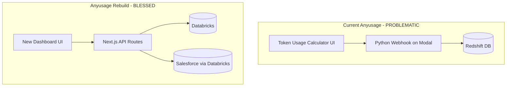

# Anyusage Rebuild Plan

## Problem Statement

The current anyusage app (in fieldsphere monorepo) has two critical issues:

1. **Wrong data source**: It connects to **Redshift** via `pg` Pool and a **Python webhook** on Modal for consumption analytics. These queries are not blessed by RevOps.
2. **Unblessed data stitching**: It stitches together event-level data, token usage calculations, and cost metrics in ways that RevOps hasn't validated, causing confusion in the GTM org about which numbers are correct.

The rebuild will use **only** RevOps-blessed queries from the `blessed-api` project, which connects to **Databricks** using the `@databricks/sql` SDK and queries sanctioned dbt models and Salesforce mirror tables.

## Architecture Overview




## Blessed Data Sources (Source of Truth)

All queries come from [blessed-api/src/db/queries/](blessed-api/src/db/queries/). The Databricks tables used:

### dbt Models (catalog: `main.dbt`)

- `dim_teams` - Team dimension table (id, name, seats, sf_subscription_id, is_enterprise, membership_type, sf_account_name)
- `dau_all` - Daily active user features list
- `int_revops_daily_user_activity` - Daily user activity by type (user_id, cursor_team_id, activity_type, dt)
- `fct_revops_daily_team_metrics` - Daily team metrics (num_active_core_users_l7d, l30d, num_agent_power_users_l7d, etc.)
- `fct_revops_monthly_team_metrics` - Monthly aggregated team metrics (api_cost_usd_month, cursor_token_fee_calc_usd_month)
- `stg_user_team` - User-to-team mapping (user_id, team_id)
- `int_monthly_user_agent_usage` - Monthly per-user agent request counts
- `fct_revops_user_metrics` - Per-user metrics (email, total_requests, total_agent_sessions, total_days_active, is_l4_user, is_power_user, last_active_at)

### Salesforce Mirror (catalog: `revops_share.pt_salesforce`)

- `subscription__c` - Subscriptions (Id, Name, Total_Licensed_Seats__c, Account__c, Open_Renewal__c)
- `account` - Accounts (Id, Name, Company_Logo_URL__c, SWE_Count__c, NumberOfEmployees, OwnerId, Technical_Account_Manager__c)
- `opportunity` - Opportunities / True-ups (Id, Name, CloseDate, Amount, License_Count__c, Subtype__c, True_Up_Number__c)
- `user` - Salesforce users (Id, ManagerId)

### Analytics (catalog: `revops.analytics` / `revops.pt_salesforce`)

- `temp_model_usage_monthly_sfdc` - Monthly model-level spend by subscription
- `subscription_overage__c` - Overage billing per subscription period

## Phase 1: Build the New UI

The new anyusage should be a **subscription-centric dashboard** (like chart-generator) rather than a team-ID + date-range calculator. The user selects a subscription (or searches by account/team), then sees blessed metrics.

### Scaffold Setup

The scaffold at [anyusage-rebuild/](anyusage-rebuild/) is already configured with:

- Next.js 16.1 + React 19 + TypeScript 5.9
- Tailwind CSS 4, shadcn/ui components (button, input, form, label)
- Prisma (can be ignored -- we use Databricks directly)
- pnpm, ESLint, Prettier, Cypress

### UI Components to Build

The landing page should have a **subscription/team selector** at the top, followed by a **tabbed dashboard** displaying all blessed metrics. Pattern this after chart-generator's `MetricsDashboard` which uses tabs: True-Ups, MAU, Model Spend, Active Users, Feature Adoption, Top Users, Depth of Usage.

#### 1. Subscription Selector (`src/components/SubscriptionSelector.tsx`)

- Combobox/search that queries `/api/subscriptions` endpoint
- Shows account name, subscription name, seat count
- Alternative: direct team ID input mode (like current anyusage)
- On selection, loads all dashboard data

#### 2. Dashboard Shell (`src/components/Dashboard.tsx`)

- Header with account name, subscription info
- Tabbed layout with 8 metric views (matching chart-generator's TAB_CONFIG)
- Loading skeletons per tab

#### 3. Chart Components (under `src/components/charts/`)

Each chart uses `recharts` for visualization:

- `MAUBarChart.tsx` - Monthly active users bar chart
- `ModelSpendChart.tsx` - Stacked area/bar chart of spend by model
- `ActiveUsersChart.tsx` - Line chart with DAU, WAU, MAU, power users
- `FeatureAdoptionChart.tsx` - Line chart of rules/MCP/agent/plan_mode adoption %
- `TopUsersTable.tsx` - Horizontal bar chart or table of top users
- `TrueUpsChart.tsx` - License growth visualization
- `DepthOfUsageChart.tsx` - Bucketed user distribution
- `OverageChart.tsx` - Monthly overage amounts
- `MonthlySpendChart.tsx` - Total spend forecast line chart

#### 4. Summary Cards (`src/components/SummaryCards.tsx`)

- Current MAU count
- Current monthly spend
- Licensed seats vs active users
- Power user count

### Dependencies to Add

```
pnpm add recharts @databricks/sql
pnpm add -D @types/node
```

Note: `@databricks/sql` is pinned at `1.12.0` in blessed-api.

## Phase 2: Connect to Blessed Data

### API Routes to Create

All routes go under `src/app/api/`. Each route connects directly to Databricks using the connection pattern from [blessed-api/src/db/connection.ts](blessed-api/src/db/connection.ts).

#### Data Layer Files

1. `**src/lib/databricks.ts**` - Databricks connection manager
  - Copy the session pool pattern from blessed-api's `connection.ts`
  - Uses `@databricks/sql` `DBSQLClient`
  - Environment variables: `DATABRICKS_SERVER_HOSTNAME`, `DATABRICKS_HTTP_PATH`, `DATABRICKS_ACCESS_TOKEN`
  - Includes `executeQuery<T>()` generic function with retry logic
2. `**src/lib/validation.ts**` - Input validation
  - Copy `_validation.ts` from blessed-api
  - Subscription ID regex: `/^[a-zA-Z0-9]{15,18}$/`
  - Team ID regex: `/^\d+$/`
  - `buildSafeInClause()`, `normalizeIds()`, `buildSubscriptionFilter()`, `buildTeamIdFilter()`
3. `**src/types/index.ts**` - All data types
  - Copy all interfaces from blessed-api's `types/index.ts`:
    - `Subscription`, `MAUGrowthData`, `ModelSpendData`, `TrueUpData`, `ActiveUsersTrendData`, `FeatureAdoptionData`, `FeatureAdoptionPercentageData`, `TopUserData`, `MonthlySpendData`, `OverageSpendData`, `DepthOfUsageData`, `EnterpriseTeam`, `AccountSearchResult`, `AccountOpportunity`

#### API Routes (each file exports GET handler)


| Route                               | Query Source                        | Params                                       |
| ----------------------------------- | ----------------------------------- | -------------------------------------------- |
| `/api/subscriptions`                | `fetchSubscriptions()`              | none                                         |
| `/api/teams/search`                 | `fetchEnterpriseTeams()`            | `q`, `limit`                                 |
| `/api/teams/[teamId]`               | `getSubscriptionByTeamId()`         | teamId (path)                                |
| `/api/teams/bulk`                   | `getSubscriptionsByTeamIds()`       | `teamIds` (comma-sep)                        |
| `/api/metrics/mau`                  | `fetchMAUGrowthData()`              | `subscriptionId(s)`, `includeCurrentMonth`   |
| `/api/metrics/model-spend`          | `fetchModelSpendData()`             | `subscriptionId(s)`, `includeCurrentMonth`   |
| `/api/metrics/active-users`         | `fetchActiveUsersTrend()`           | `subscriptionId(s)`, `includeCurrentMonth`   |
| `/api/metrics/feature-adoption`     | `fetchFeatureAdoptionData()`        | `subscriptionId(s)`, `includeCurrentMonth`   |
| `/api/metrics/feature-adoption-pct` | `fetchFeatureAdoptionPercentages()` | `subscriptionId(s)`, `includeCurrentMonth`   |
| `/api/metrics/top-users`            | `fetchTopUsersData()`               | `subscriptionId(s)`, `limit`                 |
| `/api/metrics/monthly-spend`        | `fetchMonthlySpend()`               | `subscriptionId(s)`, `includeCurrentMonth`   |
| `/api/metrics/overage`              | `fetchOverageSpend()`               | `subscriptionId(s)`                          |
| `/api/metrics/true-ups`             | `fetchTrueUpsData()`                | `subscriptionId(s)`                          |
| `/api/metrics/depth-of-usage`       | `fetchDepthOfUsageData()`           | `teamId(s)`, `months`, `includeCurrentMonth` |
| `/api/accounts/search`              | `searchAccounts()`                  | `q`, `limit`                                 |
| `/api/accounts/[id]/opportunities`  | `fetchAccountOpportunities()`       | id (path)                                    |


### SQL Queries (Exact Blessed Versions)

Every SQL query MUST be copied exactly from the blessed-api query files. The key queries and their source tables are documented in the blessed-api files listed above. Do NOT write custom SQL. Do NOT join tables in ways not shown in the blessed queries.

### Environment Variables Required

```
DATABRICKS_SERVER_HOSTNAME=<workspace>.cloud.databricks.com
DATABRICKS_HTTP_PATH=/sql/1.0/warehouses/<warehouse-id>
DATABRICKS_ACCESS_TOKEN=<pat-token>
```

Add a `.env.example` file with these placeholder values.

## What Changed vs Old Anyusage


| Aspect           | Old (Problematic)            | New (Blessed)                                               |
| ---------------- | ---------------------------- | ----------------------------------------------------------- |
| Data source      | Redshift via `pg` Pool       | Databricks via `@databricks/sql`                            |
| Primary key      | Team ID + date range         | Subscription ID (Salesforce)                                |
| Consumption data | Python webhook on Modal      | Direct Databricks queries                                   |
| Cost calculation | Custom token/event stitching | `fct_revops_monthly_team_metrics` (pre-aggregated)          |
| Model spend      | Webhook-provided breakdown   | `revops.analytics.temp_model_usage_monthly_sfdc`            |
| User metrics     | Custom Redshift queries      | `fct_revops_user_metrics`, `int_revops_daily_user_activity` |
| Active users     | Custom unique user count     | `fct_revops_daily_team_metrics` (DAU/WAU/MAU/PU)            |
| Contract scoping | Inline JS calculation        | Removed -- out of scope for v1                              |


## What to Drop from Old Anyusage

These features from the old anyusage should NOT be rebuilt because they rely on unblessed data:

- **Token Usage Calculator** (the entire contract scoping calculator with $480/seat math)
- **User Spend Distribution** (bucketed by dollar spend per user -- unblessed)
- **Consumption Analytics webhook** (the Modal-hosted Python webhook)
- **Event-level queries** (events-by-model, events-by-type, raw-events)
- **Bugbot consumption** endpoint
- **Salesforce embedding mode** (can be re-added later)

## Future: Blessed API Integration

Once the inline API routes are stable, they should be migrated to call the `blessed-api` service instead of querying Databricks directly. The blessed-api already has these endpoints:

- `GET /api/v1/subscriptions`
- `GET /api/v1/teams/search`
- `GET /api/v1/teams/:teamId`
- `GET /api/v1/teams/bulk`
- `GET /api/v1/metrics/mau`
- `GET /api/v1/metrics/model-spend`
- `GET /api/v1/metrics/active-users`
- `GET /api/v1/metrics/feature-adoption`
- `GET /api/v1/metrics/feature-adoption-pct`
- `GET /api/v1/metrics/top-users`
- `GET /api/v1/metrics/monthly-spend`
- `GET /api/v1/metrics/overage`
- `GET /api/v1/metrics/true-ups`
- `GET /api/v1/metrics/depth-of-usage`
- `GET /api/v1/accounts/search`
- `GET /api/v1/accounts/:id/opportunities`

The blessed-api uses API key auth (`API_KEYS` env var, comma-separated). When switching, the anyusage-rebuild would call these endpoints with `BLESSED_API_URL` and `BLESSED_API_KEY` env vars instead of connecting to Databricks directly.

## File Structure for Rebuild

```
src/
  app/
    page.tsx                          -- Landing page with selector + dashboard
    layout.tsx                        -- Root layout (already exists)
    globals.css                       -- Styles (already exists)
    api/
      subscriptions/route.ts          -- List all subscriptions
      teams/
        search/route.ts               -- Enterprise team search
        bulk/route.ts                 -- Bulk team-to-subscription lookup
        [teamId]/route.ts             -- Single team lookup
      metrics/
        mau/route.ts
        model-spend/route.ts
        active-users/route.ts
        feature-adoption/route.ts
        feature-adoption-pct/route.ts
        top-users/route.ts
        monthly-spend/route.ts
        overage/route.ts
        true-ups/route.ts
        depth-of-usage/route.ts
      accounts/
        search/route.ts
        [id]/
          opportunities/route.ts
  components/
    SubscriptionSelector.tsx
    Dashboard.tsx
    SummaryCards.tsx
    charts/
      MAUBarChart.tsx
      ModelSpendChart.tsx
      ActiveUsersChart.tsx
      FeatureAdoptionChart.tsx
      TopUsersTable.tsx
      TrueUpsChart.tsx
      DepthOfUsageChart.tsx
      OverageChart.tsx
      MonthlySpendChart.tsx
      ChartSkeleton.tsx
    ui/                               -- Already exists (shadcn)
  lib/
    databricks.ts                     -- Connection pool + executeQuery
    validation.ts                     -- Input validation helpers
    utils.ts                          -- Already exists
  types/
    index.ts                          -- All data interfaces
```

